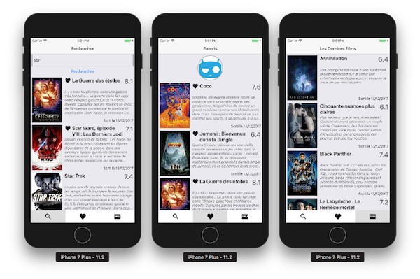

Welcome to MovieBox
===================

Welcome to this project about Mobile App using the React Native framework! This is a framework created by Facebook following a Hackaton in 2015. React Native is based on React, a JavaScript library developed two years ago by a Facebook engineer (Jordan Walke). You will discover why Facebook, Instagram, Skype, Discord and many others have chosen this framework for their mobile applications.

### Where does the idea of ​​creating our MovieBox Mobile App come from ?

You all know this situation where you discuss a film with your friends, you boast of its merits, but you can not remember his name! 
Or this text that we receive: "Hey, what's the name of the movie you've already told me about?"

No more blockages, endless expectations, grilled neurons to think. I propose here to make a mobile application to manage your movies.

So, we're going to build a mobile App that will save us time and space memory of our human brain;
In addition, the list of films will contain a description of each film, facilitating the task when we share a film with a friend. We will not need to make long comments about the movie.

-------------------------------------------------------------------------------

### Prerequisites :

  * To be able to follow this project, you must know the basics of Object Oriented Programming (OOP) and Javascript: create a function, a variable, import a file or manipulate an object.

  * You do not need to know 'React Native' to keep pace with our project。

  * You can check this official web page of ['React Native'](https://facebook.github.io/react-native/docs/getting-started.html#using-a-virtual-device) to get an idea of ​​what it looks like and to find out what it is ...

-------------------------------------------------------------------------------
## Project contents

In this project, we have 5 major steps to carry out for the complete realization of our mobile application.

the main stages of this project by order of execution are the following :

   1. Requirements Analysis & tasks splitting in the Work Team ;
   2. Setting up the developer's work environment for React Native ;
   3. Design and build the mobile application ;
   4. Write the final report (and writing other documents as part of the realization of this project) ;
   5. App Preparation for Apple and Google Stores ...

## Team members & responsibilities of each member

### Team members :

Our team of work includes 2 developers, both are students in computer science and technology at [*Wuhan University*](https://www.whu.edu.cn/) :
   * KIBWILA KIFILU PHINEES (Team Captain)
   * RUBANGO MUSIMWA MARIE I.N. (Assistant Captain)

### responsibilities of each developer

   * KIBWILA PHINEES KIFILU :

   		* Requirements Analysis  (in collaboration with RUB...) ;
   		* Setting up the developer's work environment  (in collaboration with RUB...) ;
   		* Build the mobile application  (in collaboration with RUB...) ;
   		* Write the final report  (in collaboration with RUB...) ;
   		* Preparation of mobile app for Apple and Google Stores (in collaboration with RUB...).

   * RUBANGO MUSIMWA MARIE I.N. :

   		* Design of mobile app  (in collaboration with KIB...) ;
   		* Test and update mobile app options  (in collaboration with KIB...) ;
   		* Control of presentation and evaluation of data (in collaboration with KIB...) ;
   		* Write the final report  (in collaboration with KIB...) ;
   		* App Audits & App Store Listing Maintenance (in collaboration with KIB...).

##### Responsibilities can evolve according to the pace of work.

-------------------------------------------------------------------------------

## Requirements Analysis

To develop software products that truly meet the needs of users, you must first understand the needs of your users.
A deep understanding of software requirements is a prerequisite for the success of software development.
No matter how well people do their design and coding work, programs that don't meet user needs will only disappoint users and cause trouble for developers.

### Concerning our project, we must:

   * Search and display a list of movies retrieved from a URL;
   * Manage application data by annotating favorite movies;
   * Share movies with your contacts with iOS / Android sharing;
   * use the native components of the phone, taking a photo or selecting it in your gallery;

Visually, here is what our final application will look like :    ...

## Mobile Application Requirement

### Mobile App Objective(s)

The mobile application MovieBox will allow fans and moviegoers to have a hand catalog of movies that they have already seen and liked, as well as future movies they will follow and like, our users will have a directory of movies easy to access anytime and anywhere.

### Product Vision Statement

A vision statement defines a clear direction towards the end goal of the mobile app. 
On top of that, a vision statement describes the solution to the problem your intended users are facing. 

Our mobile application will solve the common problem that each of us has faced once in his life.
Forgetting the movie title or movie's name is a problem that happens to the youngest, to adults, that happens to old men also.

The memory hole does not just happen to the old ones, so let's solve this problem together.

### Create a List of Features

The first version of the MovieBox mobile app needs to offer a simple and intuitive user experience. 
Choosing features for a mobile app is a planning process that requires you to define the product vision, objectives, and themes fully. 

Here are the standard features that MovieBox will include:

* Sign-up and login
* Splash screen
* Navigation
* Image galleries
* Forms
* Push notifications
* Native maps
* Device hardware access
* App analytics

The list above is only a small list of potential features MovieBox might require. 
Understanding how a user will navigate through the MovieBox app is critical for identifying the necessary features that will allow for seamless user experience.

### Monetization Model

There are several monetization strategies worth exploring. The strategy we'll choose will depend on the type of app y we’re developing, our target user, and even the mobile operating system we're going to utilize.

Conventional monetization models include advertising, pay per download, in-app purchases, freemium, and subscriptions.

For now, we will not use any monetization model; We will come back to this topic a little later in our project and we don't forget that the goal is also to make money.

### Product & Technical Specifications

Product and technical specifications outline the systemic and functional needs to meet for the product to achieve the desired features and functionalities.

To make it simple, here we will do a question/answer game.

* What platforms will the app will you use ? 

	* Answer : iOS & Android

* What operating system versions should support it?

	* Answer : React Native apps may target iOS 9.0 and Android 4.1 (API 16) or newer.

*  What are MovieBox's current API/services, servers, databases?  (Dependencies)

	* Answer : [The Movie Database (TMDb) - API ](https://www.themoviedb.org/about)

*  What are the maintenance needs? Do we need to support it for the future? (Maintenance and Upgrade Requirements)

	* Answers : 

		* Standard maintenance as a minimum – such as security updates, bug fixes and audits against the latest versions of iOS and Android

		* New features and enhancements

		* Performance monitoring

* How long should the app function before an overhaul is needed?

	* Answers : 
		* Update frequency will depend on user feedback, data, and team size ;
		* we plan 2-4 months updates in advance but we keep attuned to market demands.

### Choosing a Platform for MovieBox

In this project, we choose to create a native app for Android and iOS using [React](https://facebook.github.io/react-native/).
[React Native](https://facebook.github.io/react-native/) combines the best parts of native development with React, a best-in-class JavaScript library for building user interfaces.

The ideal approach to development is to launch on both platforms; however, that’s not always feasible.
Sometimes, you will have to develop for one platform first and introduce a second platform later for reasons like time constraints, budget, and resource limitations.

Both iOS and Android offer distinct advantages, but also attract contrasting users.
It’s essential to do enough research to understand which OS meets the success criteria of your product goals.

You can use [React Native](https://facebook.github.io/react-native/) today in your existing Android and iOS projects or you can create a whole new app from scratch.

React Native is being used in thousands of apps, but it's likely you've already used it in one of these apps:

-------------------------------------------------------------------------------

### Constraints

The constraints we face are related to scope, budget and time.
However, our constraints include aspects such as risk tolerance, resources / personnel and quality requirements.

-------------------------------------------------------------------------------

### Submission

MovieBox mobile app requirements document will include all technical assets and information required for Apple’s App Store submission and Google Play submission. 

Defining these requirements in the early stages of a project will significantly expedite the submission process when the product is ready for release.
While these will vary depending on the app stores being submitted to, below are the assets and information to include for the Apple App Store and Google Play.

#### General Assets :

* Icons of supported sizes (iOS: @1x @2x @3x images | Android: mdpi, hdpi, xhdpi, xxhdpi)
* Splash screens of recommended sizes (iOS: @1x @2x @3x images | Android: mdpi, hdpi, xhdpi, xxhdpi)
* Screenshots in the correct dimensions and required languages
* App descriptions in required languages
* Search keywords in required languages
* List of supported devices and OS versions

#### Apple App Store :

* iTunes Connect Account access
* Company/Entity Name
* App Store app listing name
* Search keywords
* Bundle id / SKU
* Demo account for reviewers
* Description
* Support URL
* Marketing URL
* Privacy policy
* App category
* Copyright information
* Contact information
* App icon (1024×1024)
* App Store distribution provision profile
* App Store distribution code signing identity
* Screenshots (correct sizes based on devices)

#### Google Play :

* Google Play Developer access
* Store listing name
* Paid/free
* Short description
* Full description
* App icon (512×512)
* Feature Graphic (1024×500)
* App type
* App category
* Content Rating
* Contact Email
* Privacy Policy
* Screenshots (correct sizes based on devices)
-------------------------------------------------------------------------------

## Keywords

#### product Requirements Document (PRD)
#### Create React Native App (CRNA)
#### Javascript (JS)
#### [The Movie Database API (TMDb API)](https://www.themoviedb.org/about)
#### Application Program Interface  (API)

-------------------------------------------------------------------------------

## Developers & Contributor(s)

* [**Kibwila Panehsy K.**](https://github.com/KIB-Phi-Kif)

* [**RubbisLeys**](https://github.com/RubbisLeys)

-------------------------------------------------------------------------------

### Annex

As the projects progress, we will have clearer ideas about some aspects of the application.

As soon as possible we'll make updates on these points :

* Business Requirements
* User Journeys

-------------------------------------------------------------------------------
